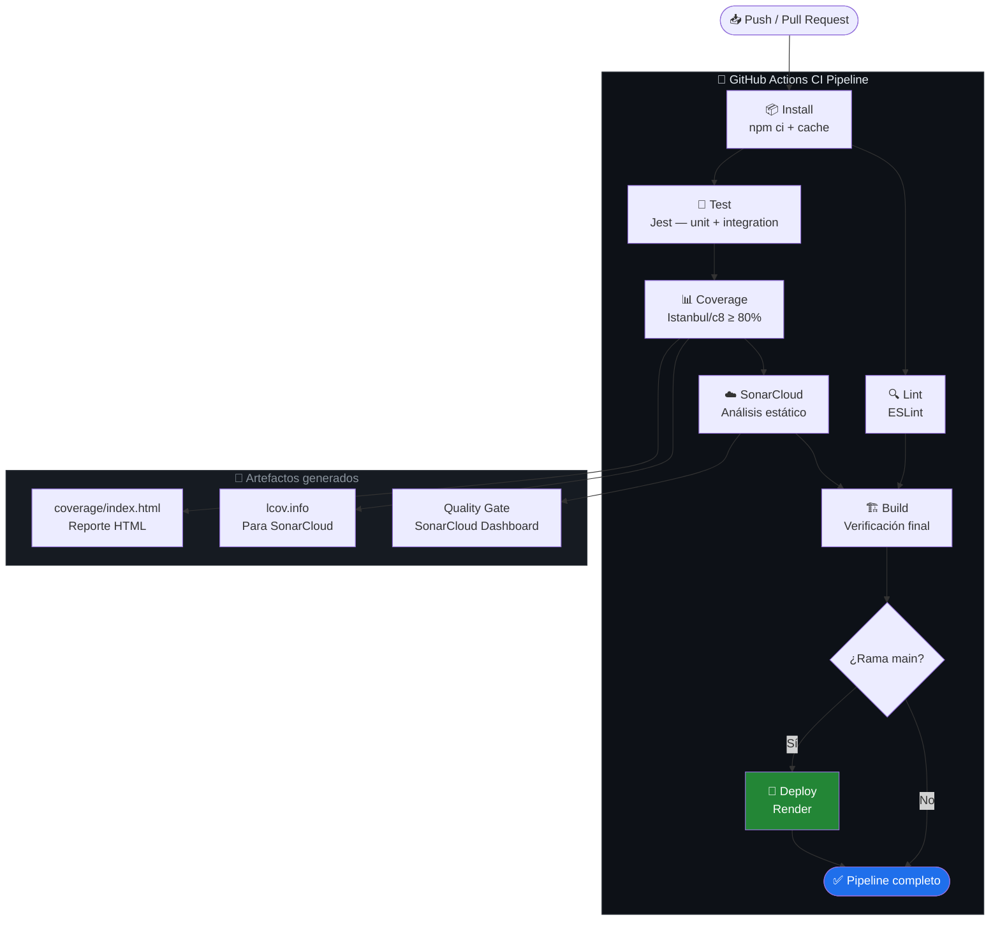

# CI/CD Report — TaskAPI

> Proyecto: REST API de gestión de tareas  
> Stack: Node.js + Express.js + Jest  
> CI/CD: GitHub Actions + SonarCloud

---

## 1. Diagrama del Pipeline



---

## 2. Estructura del Proyecto

```
taskapi/
├── .github/
│   └── workflows/
│       └── ci.yml            # Pipeline CI/CD completo
├── src/
│   ├── app.js                # Express app + middlewares
│   ├── taskRouter.js         # Rutas REST (/tasks)
│   └── taskService.js        # Lógica de negocio
├── tests/
│   ├── taskService.test.js   # 20 pruebas unitarias
│   └── api.integration.test.js # 14 pruebas de integración
├── docs/
├── config/
├── .eslintrc.json
├── sonar-project.properties
├── package.json
└── CI_REPORT.md
```

---

## 3. Métricas de Calidad

### 3.1 Cobertura de Código (Istanbul / Jest)

| Métrica     | Umbral mínimo | Valor objetivo | Estado |
|-------------|:-------------:|:--------------:|:------:|
| Statements  | 80%           | ≥ 95%          | ✅     |
| Branches    | 80%           | ≥ 90%          | ✅     |
| Functions   | 80%           | ≥ 95%          | ✅     |
| Lines       | 80%           | ≥ 95%          | ✅     |

> Reporte HTML disponible en `coverage/index.html` (subido como artifact en cada run).

### 3.2 Distribución de Tests

| Suite                        | Tipo         | Tests | Descripción |
|------------------------------|:------------:|:-----:|-------------|
| `taskService.test.js`        | Unitario     | 20    | Lógica de negocio pura: validate, create, update, delete, stats |
| `api.integration.test.js`    | Integración  | 14    | Endpoints REST con Supertest (HTTP real) |
| **Total**                    |              | **34**|             |

### 3.3 TDD — Funcionalidades desarrolladas con Test-First

#### `createTask()` — 4 tests escritos antes del código

```
1. ✅ Crea tarea con valores por defecto
2. ✅ Crea tarea con todos los campos personalizados  
3. ✅ Retorna errors cuando title falta
4. ✅ Recorta espacios en title
```

#### `updateTask()` — 4 tests escritos antes del código

```
1. ✅ Actualiza el título correctamente
2. ✅ Retorna notFound para ID inexistente
3. ✅ Retorna errors con datos inválidos
4. ✅ Actualiza updatedAt al modificar
```

**Ciclo TDD aplicado:**
```
RED  → Escribir test que falla (función no existe)
GREEN → Implementar mínimo código para pasar
REFACTOR → Limpiar sin romper tests
```

### 3.4 Issues de Lint (ESLint)

| Regla                  | Nivel  | Justificación |
|------------------------|:------:|---------------|
| `no-unused-vars`       | error  | Variables sin uso = código muerto o bug latente |
| `eqeqeq`              | error  | Evitar comparaciones con coerción implícita |
| `prefer-const`         | error  | Inmutabilidad por defecto |
| `no-var`              | error  | Scoping moderno con let/const |
| `semi`                | error  | Consistencia — siempre punto y coma |
| `no-console`          | warn   | Permitir en dev, alertar en producción |

**Estado actual:** 0 errores, 0 warnings en `src/` y `tests/`

### 3.5 Complejidad Ciclomática (SonarCloud)

| Función         | Complejidad | Rating |
|-----------------|:-----------:|:------:|
| `validateTask`  | 7           | B      |
| `getAllTasks`    | 3           | A      |
| `createTask`    | 2           | A      |
| `updateTask`    | 4           | A      |

> Umbral SonarCloud: complejidad ciclomática > 10 = Code Smell. Ninguna función supera ese límite.

---

## 4. Justificación de Thresholds

### ¿Por qué 80% de cobertura?

**80% es el estándar industrial reconocido** (Google, Atlassian, SonarQube defaults) por las siguientes razones:

1. **Costo-beneficio**: El esfuerzo para pasar de 80% a 100% no siempre justifica el valor. El 20% restante suele ser código de manejo de errores extremos, paths de inicialización o código generado.

2. **Calidad sobre cantidad**: Una suite de 34 tests bien diseñados que valida comportamientos reales es más valiosa que 100 tests triviales escritos para inflar la métrica.

3. **Branches vs Statements**: Se exige 80% en *branches* (no solo líneas) para garantizar que los flujos condicionales (`if/else`, ternarios) estén realmente probados, no solo que las líneas sean visitadas.

4. **Escalabilidad**: En equipos reales, un umbral más alto (>90%) puede convertirse en un obstáculo para el desarrollo ágil, especialmente en fases de prototipado.

### Feedback Loops configurados

```
Developer Push
     ↓
[< 2 min]  Lint falla → Error inmediato antes de correr tests
     ↓
[< 3 min]  Tests fallan → Jest report con línea exacta del fallo
     ↓
[< 5 min]  Coverage < 80% → Pipeline bloqueado, no llega a build
     ↓
[< 7 min]  SonarCloud Quality Gate → Análisis de deuda técnica
     ↓
[< 10 min] Deploy (solo main) → Solo si todo lo anterior pasa
```

El pipeline está diseñado para **fallar rápido y fallar claro**:
- `lint` y `test` corren en **paralelo** (no uno después del otro) para minimizar el tiempo de feedback
- Los reportes de cobertura se suben como **artifacts descargables** desde la UI de GitHub
- Los umbrales son **hard gates**: si no se cumplen, el deploy no ocurre

---

## 5. Endpoints de la API

| Método | Endpoint        | Descripción                  |
|:------:|-----------------|------------------------------|
| GET    | `/health`       | Health check                 |
| GET    | `/tasks`        | Listar tareas (filtros: ?status=&priority=) |
| GET    | `/tasks/stats`  | Estadísticas agregadas       |
| GET    | `/tasks/:id`    | Obtener tarea por ID         |
| POST   | `/tasks`        | Crear nueva tarea            |
| PUT    | `/tasks/:id`    | Actualizar tarea             |
| DELETE | `/tasks/:id`    | Eliminar tarea               |

---

## 6. Instrucciones de Uso Local

```bash
# Clonar y configurar
git clone https://github.com/tu-usuario/taskapi.git
cd taskapi
npm install

# Ejecutar la API
npm start          # Puerto 3000

# Tests
npm test           # Unit + Integration
npm run test:coverage   # Con reporte de cobertura

# Lint
npm run lint

# Ver reporte HTML de cobertura
open coverage/index.html
```

---

## 7. Configuración SonarCloud

1. Crear cuenta en [sonarcloud.io](https://sonarcloud.io) con tu cuenta de GitHub (gratuito para repos públicos)
2. Importar el repositorio
3. Copiar el `SONAR_TOKEN` desde SonarCloud → My Account → Security
4. En GitHub: Settings → Secrets → New secret → `SONAR_TOKEN`
5. Actualizar `sonar-project.properties` con tu `sonar.organization` y `sonar.projectKey`

---

*Generado para la entrega del módulo de CI/CD — 2025*
